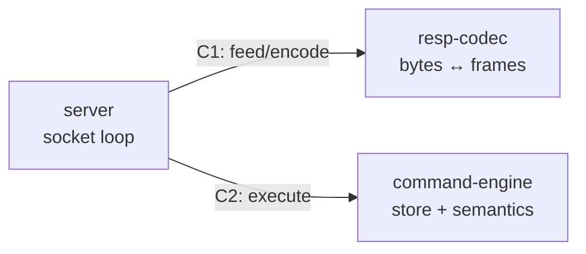

# RESP tracer — Design Spec

> Pilot spec: the first sprint run under the protocol, and preparation for
> bench v0.9 (the organic shakedown — no injected events). Instantiates
> `docs/spec-template.md`.

## Overview

A minimal Redis-compatible server speaking RESP2, built by the org to
exercise the entire protocol lifecycle: spec → tracer bullet → work packages
→ execution → review ladder → integration → retro → cold-start audit.
**Externally graded** in the sense that matters: the conformance assertions
encode Redis's own RESP2 behavior and are driven through a real, unmodified
`redis-cli` client, and the exam is frozen by the lead before fan-out so no
implementer can tune it to their code. (The lead *authors* the assertion
list from the RFC/Redis behavior — "external" means the grader is a real
client and the target of conformance is an outside standard, not that a
third party writes the file.)

## Goals and Non-goals

**Goals**

- Commands: `PING`, `ECHO`, `GET`, `SET`, `DEL`, `INCR` — binary-safe
  values, correct RESP2 reply types, correct error replies for wrong arity
  and non-integer `INCR`.
- Pipelined sequential requests on one connection.
- Every boundary contract exercised by consumer-driven boundary tests.
- Every protocol artifact type whose trigger fires gets produced (that is
  the actual product; the server is the medium). Unfired triggers owe
  nothing — no synthetic incidents.

**Non-goals** (excluded per council bench ruling): expiry, persistence,
transactions, pub/sub, clustering, authentication, concurrency beyond one
connection at a time, performance claims, RESP3.

## Decisions

- **Language:** Python 3, stdlib only. Rationale: fastest to grade and
  review; nothing here is performance-bearing. Changeable by amendment.
- **Concurrency model:** sequential accept loop, one connection served at a
  time. Rationale: "pipelined sequential" is the graded behavior;
  `redis-cli` needs one connection; smallest defensible design.

## Firewalled Entities and Contract Boundaries

Three entities, two contracts. Each entity is one work package owner's
scope; each contract is a `protocol/templates/contract.md` instance living
in `contracts/` before fan-out.

1. **resp-codec** — bytes ↔ frames. Incremental parser (feed bytes, yield
   complete frames, retain remainder) and serializer. No socket, no store,
   no command knowledge.
2. **command-engine** — command frame in, reply frame out, owning the
   key-value store. No bytes, no sockets. Deterministic: same command
   sequence, same replies.
3. **server** — socket lifecycle: accept, read → codec → engine → codec →
   write, connection teardown. No parsing, no command knowledge. Consumes
   both contracts.

- **C1 codec contract:** frame data model (simple string, error, integer,
  bulk string incl. null, array), `feed(bytes) -> [Frame]` incremental
  semantics, `encode(Frame) -> bytes`, behavior on malformed input
  (raise `ProtocolError`, connection-fatal).
- **C2 engine contract:** `execute(command: Array[BulkString]) -> Frame`,
  per-command semantics and error replies, state visibility rules.

## Boundary Diagram

## Interpretations Log

None yet. Filed against contracts in `contracts/` per protocol.

## Conformance grading

The exam is `bench/conformance/resp_conformance.sh`, authored by the lead at
M1 **before fan-out** and frozen for the sprint. It starts the server on an
ephemeral port, drives it exclusively through a real `redis-cli`
(`redis-cli -p $PORT <args>` and piped pipelining), asserts expected replies
for: each goal command's happy path, binary-safe values (embedded `\r\n`,
NUL), wrong-arity errors, `INCR` on a non-integer, `GET` on a missing key,
and a pipelined batch on one connection. Pass = exit 0 with every assertion
green; any assertion failure or server crash = fail. Implementers may run it
freely but never edit it; changes to the exam are spec amendments.

## Milestones

- **M1 — tracer bullet (lead-built, player-coach):** repo layout, contract
  documents committed, boundary-test skeletons, the frozen conformance
  script, and a walking end-to-end slice — `redis-cli PING` answers `PONG`
  through all three entities in their crudest form. Proves the contracts
  compose before fan-out.
- **M2 — fan-out:** three work packages (one per entity) execute under the
  full ladder: council review at implementer tier, lead review, fix-delta
  rounds to CLEAN.
- **M3 — integration and closure:** conformance script green via real
  `redis-cli`; retro (lessons, meta:product ratio, deviation adjudication);
  cold-start audit by a fresh agent in a second harness.

## Open Questions

- Should inline commands (non-RESP `PING\r\n` as redis-cli sometimes sends
  on simple probes) be in scope? Current lean: yes if `redis-cli` in
  practice requires it for the graded commands, discovered at M1 —
  otherwise a filed non-goal clarification.
